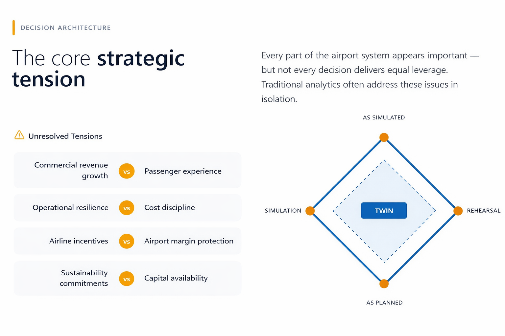

# Business Architecture & Decision Intelligence  
## Airport Operations Strategy & Transformation

This repository presents a **business architecture and decision intelligence analysis** of airport operations, focused on identifying **where leadership attention, data, and analytics create the greatest leverage**.

Rather than optimising individual processes, the work reframes airport operations as a **system of interdependent decisions**, shaped by regulation, capacity constraints, airline relationships, sustainability commitments, and capital intensity.

This is positioned as **aviation strategy and transformation analysis**, not operational reporting.

## What this project demonstrates

- Airport, airline, and air transport domain understanding  
- Decision-centric business architecture thinking  
- Ability to prioritise transformation under real-world constraints  
- Translation of data into executive-level decision guidance  

The analysis is relevant to **airport operators, airline partners, regulators, and air transport consultancies**.

## How to navigate this repository

- **analysis/**  
  Flagship decision architecture narrative and supporting analytical work  

- **data/**  
  Simplified airport decision intelligence dataset used for comparative prioritisation  

- **visuals/**  
  Stakeholder-facing decision landscape highlighting high-leverage decision areas  

## Core business question

Which airport operational decisions deliver disproportionate commercial and customer impact, and how should leadership prioritise data, analytics, and transformation investment?

## Insight snapshot

*Airport value creation is shaped by a small number of unresolved strategic tensions.  
Decision architecture focuses leadership attention on where these tensions must be actively managed, rather than optimised away.*

## Why this matters

Airport leadership teams face sustained pressure from:

- Capacity constraints and infrastructure limits  
- Airline negotiations and route economics  
- Sustainability and net-zero mandates  
- Margin pressure and capital discipline  

This project demonstrates how **decision architecture** enables leaders to focus effort where it matters most, without over-optimising or fragmenting the system.

## Skills demonstrated

- Business architecture  
- Decision intelligence  
- Aviation and air transport strategy  
- Transformation prioritisation  
- Executive-level communication  
